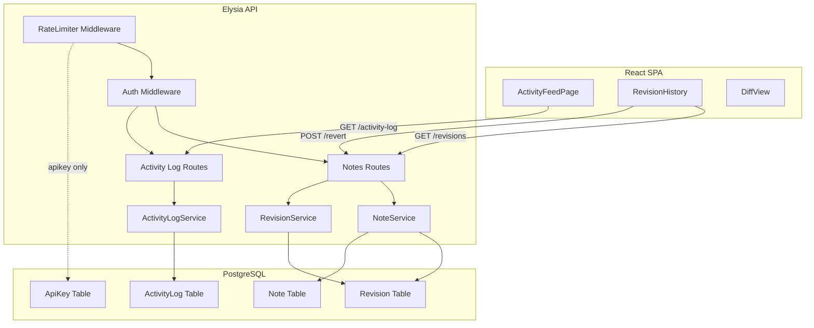
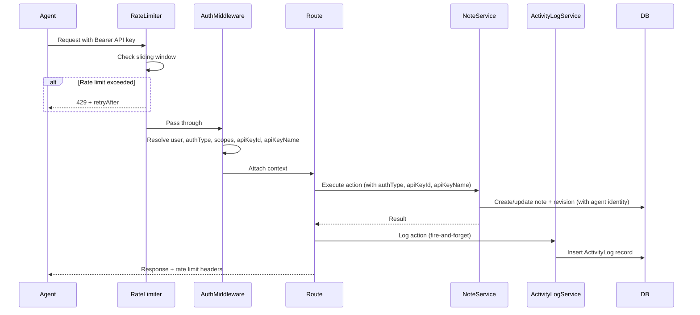

# Design Document: Agent Activity Log

## Overview

This feature adds observability and governance to Mycelium's agent API by introducing six capabilities: activity logging, agent identity on revisions, visual differentiation of agent vs. human edits, a dedicated activity feed page, revision revert functionality, and per-API-key rate limiting.

The design builds on the existing Elysia + Prisma backend, React + TanStack Query frontend, and the auth middleware that already resolves `authType` (`jwt` | `apikey`) and `scopes` from request context. The key insight is that the auth middleware already distinguishes agent from human requests — this feature threads that identity through to persistence, UI, and rate control.

### Key Design Decisions

1. **In-process activity logging** — Activity logs are written via Prisma in the same process rather than an external queue. This keeps the stack simple and avoids new infrastructure. The write is fire-and-forget (errors logged, not thrown) to avoid blocking API responses.

2. **Schema extension over new tables for revisions** — Agent identity fields (`authType`, `apiKeyId`, `apiKeyName`) are added directly to the existing `Revision` model rather than a join table. This keeps revision queries simple and avoids N+1 lookups.

3. **In-memory sliding window rate limiter** — A `Map<string, number[]>` tracks timestamps per API key. This is sufficient for a single-process deployment. The design is extracted into a standalone module so it can be swapped for Redis-backed storage later without changing the middleware interface.

4. **Revert as a new save** — Reverting creates a new revision with the old content rather than deleting revisions. This preserves full audit history and is consistent with the existing immutable revision model.

## Architecture



### Request Flow for Agent Actions



## Components and Interfaces

### Backend Components

#### 1. ActivityLogService (`apps/api/src/services/activity-log.service.js`)

New service responsible for creating and querying activity log records.

```js
/**
 * @typedef {Object} ActivityLogEntry
 * @property {string} id
 * @property {string} userId
 * @property {string} apiKeyId
 * @property {string} apiKeyName
 * @property {string} action - One of: note:create, note:update, note:archive, note:delete, note:search, note:revert, bundle:read
 * @property {string|null} targetResourceId - Note ID or null
 * @property {string|null} targetResourceSlug - Note slug or null
 * @property {Object} details - JSON object with action-specific context
 * @property {string} status - 'success' | 'error'
 * @property {Date} createdAt
 */

export const ActivityLogService = {
  /**
   * Create an activity log record. Errors are caught and logged,
   * never thrown to the caller.
   *
   * @param {Object} params
   * @param {string} params.userId
   * @param {string} params.apiKeyId
   * @param {string} params.apiKeyName
   * @param {string} params.action
   * @param {string|null} params.targetResourceId
   * @param {string|null} params.targetResourceSlug
   * @param {Object} params.details
   * @param {string} params.status
   * @returns {Promise<void>}
   */
  async logAction(params) { /* ... */ },

  /**
   * List activity log entries with cursor-based pagination and optional filters.
   *
   * @param {string} userId
   * @param {{ cursor?: string, limit?: number, action?: string, apiKeyName?: string }} opts
   * @returns {Promise<{ entries: ActivityLogEntry[], nextCursor: string|null }>}
   */
  async listEntries(userId, opts) { /* ... */ },
};
```

#### 2. RateLimiter Middleware (`apps/api/src/middleware/rate-limiter.js`)

New Elysia plugin that enforces per-API-key sliding window rate limiting.

```js
/**
 * @typedef {Object} RateLimiterConfig
 * @property {number} windowMs - Sliding window size in milliseconds (default: 60000)
 * @property {number} maxRequests - Max requests per window (default: 60)
 */

/**
 * Creates an Elysia plugin that rate-limits API key requests.
 * JWT-authenticated requests pass through without rate limiting.
 *
 * @param {RateLimiterConfig} [config]
 * @returns {Elysia}
 */
export function rateLimiter(config) { /* ... */ }
```

Internal state: `Map<string, number[]>` where key is `apiKeyId` and value is an array of request timestamps. On each request, expired timestamps are pruned, the current timestamp is pushed, and the count is checked against `maxRequests`.

Response headers on every API-key request:
- `X-RateLimit-Limit`: 60
- `X-RateLimit-Remaining`: remaining count
- `X-RateLimit-Reset`: Unix epoch seconds when the oldest entry expires

#### 3. Auth Middleware Enhancement (`apps/api/src/middleware/auth.js`)

The existing `resolveAuth` function is extended to also return `apiKeyId` and `apiKeyName` when the request is authenticated via API key. This requires a small change to `AuthService.verifyApiKey` to return the key's `id` and `name` alongside the user and scopes.

```js
// Updated return shape from resolveAuth:
{
  user: { id, email, displayName, ... },
  authType: 'jwt' | 'apikey',
  scopes: string[],
  apiKeyId: string | null,    // NEW
  apiKeyName: string | null,  // NEW
}
```

#### 4. NoteService Enhancement (`apps/api/src/services/note.service.js`)

`createNote` and `updateNote` accept optional `authType`, `apiKeyId`, and `apiKeyName` parameters. When creating a revision, these fields are passed through to the `Revision` record.

A new `revertNote` method is added:

```js
/**
 * Revert a note to a specific revision's content.
 *
 * @param {string} userId
 * @param {string} slug
 * @param {string} revisionId
 * @param {{ authType?: string, apiKeyId?: string, apiKeyName?: string }} authContext
 * @returns {Promise<Note>}
 */
async revertNote(userId, slug, revisionId, authContext) { /* ... */ }
```

#### 5. RevisionService Enhancement (`apps/api/src/services/revision.service.js`)

The `listRevisions` query is updated to include the new `authType`, `apiKeyId`, and `apiKeyName` fields in the select/return.

#### 6. Activity Log Routes (`apps/api/src/routes/activity-log.routes.js`)

New route group at `/api/v1/activity-log`:

| Method | Path | Description |
|--------|------|-------------|
| GET | `/api/v1/activity-log` | List activity log entries (paginated, filterable) |

Query parameters: `cursor`, `limit`, `action`, `apiKeyName`.

#### 7. Notes Routes Enhancement (`apps/api/src/routes/notes.routes.js`)

New route added:

| Method | Path | Description |
|--------|------|-------------|
| POST | `/api/v1/notes/:slug/revert` | Revert note to a specific revision |

Body: `{ revisionId: string }`.

Existing note mutation routes (POST, PATCH, DELETE) are enhanced to call `ActivityLogService.logAction` after the operation completes, when `authType === 'apikey'`.

### Frontend Components

#### 8. ActivityFeedPage (`apps/web/src/pages/ActivityFeedPage.jsx`)

New lazy-loaded page component accessible at `/activity` route. Displays a chronological list of agent activity log entries with filter controls.

**State management**: Uses TanStack Query with key factory `activityKeys`.

**Filter controls**:
- Action type dropdown (all, note:create, note:update, etc.)
- API key name dropdown (populated from distinct values in the response)

**Pagination**: "Load more" button using cursor-based pagination, consistent with the existing note list pattern.

**Empty state**: Message "No agent activity recorded yet" when no entries exist.

#### 9. RevisionHistory Enhancement (`apps/web/src/components/rightpane/RevisionHistory.jsx`)

Enhanced to:
- Display an "agent" badge with the API key name for revisions where `authType === 'apikey'`
- Show a "Revert to this version" button on each revision (both agent and human)
- Trigger a confirmation dialog before executing the revert
- Call `POST /api/v1/notes/:slug/revert` with the revision ID

#### 10. Sidebar Enhancement (`apps/web/src/components/sidebar/Sidebar.jsx`)

Add an "Agent Activity" nav item between "Graph" and the Tags section, linking to `/activity`.

### API Hooks (`apps/web/src/api/hooks.js`)

New hooks:
- `useActivityLog(filters)` — fetches paginated activity log entries
- `useRevertNote(slug)` — mutation hook for reverting a note to a revision

New query key factory:
- `activityKeys.lists(filters)` — `['activity-log', 'list', filters]`

## Data Models

### New: ActivityLog Table

```prisma
model ActivityLog {
  id                 String   @id @default(cuid())
  userId             String
  apiKeyId           String
  apiKeyName         String
  action             String   // note:create, note:update, note:archive, note:delete, note:search, note:revert, bundle:read
  targetResourceId   String?
  targetResourceSlug String?
  details            Json     @default("{}")
  status             String   @default("success") // success | error
  createdAt          DateTime @default(now())
  user               User     @relation(fields: [userId], references: [id], onDelete: Cascade)

  @@index([userId, createdAt])
  @@index([userId, action])
  @@index([userId, apiKeyName])
}
```

### Modified: Revision Table

Three new optional fields added:

```prisma
model Revision {
  id         String   @id @default(cuid())
  content    String
  message    String?
  authType   String?  // 'jwt' | 'apikey' | null (null for pre-existing revisions)
  apiKeyId   String?
  apiKeyName String?
  createdAt  DateTime @default(now())
  noteId     String
  note       Note     @relation(fields: [noteId], references: [id], onDelete: Cascade)

  @@index([noteId])
}
```

### Modified: User Model

Add relation to ActivityLog:

```prisma
model User {
  // ... existing fields ...
  activityLogs ActivityLog[]
}
```

### Migration Strategy

A single Prisma migration adds:
1. The `ActivityLog` table with indexes
2. Three nullable columns (`authType`, `apiKeyId`, `apiKeyName`) to the `Revision` table

Existing revisions will have `null` for all three new fields, which the UI treats as "human" (pre-feature revisions).


## Correctness Properties

*A property is a characteristic or behavior that should hold true across all valid executions of a system — essentially, a formal statement about what the system should do. Properties serve as the bridge between human-readable specifications and machine-verifiable correctness guarantees.*

### Property 1: Activity log completeness

*For any* agent action (success or failure) with any valid action type, API key identity, and target resource, the `ActivityLogService.logAction` call SHALL persist a record containing the userId, apiKeyId, apiKeyName, action, targetResourceId, targetResourceSlug, details, and the correct status ('success' or 'error'). All persisted field values SHALL match the input parameters.

**Validates: Requirements 1.1, 1.3**

### Property 2: Revision identity reflects authentication context

*For any* revision created during a note save, if the authentication context is `apikey` then the revision record SHALL have `authType` equal to `'apikey'` and non-null `apiKeyId` and `apiKeyName` matching the authenticating key; if the authentication context is `jwt` then the revision record SHALL have `authType` equal to `'jwt'` and null `apiKeyId` and `apiKeyName`.

**Validates: Requirements 2.1, 2.2, 2.3**

### Property 3: Activity log ordering and pagination completeness

*For any* set of N activity log entries belonging to a user, paginating through the listing endpoint with any valid page size SHALL return all N entries exactly once, and the entries within and across pages SHALL be ordered by `createdAt` descending.

**Validates: Requirements 4.1, 4.2**

### Property 4: Activity log filtering correctness

*For any* set of activity log entries and any combination of `action` and `apiKeyName` filters, every entry returned by the listing endpoint SHALL match all applied filter criteria, and no matching entry SHALL be omitted from the results.

**Validates: Requirements 4.3**

### Property 5: Revert preserves target revision content

*For any* note with at least two revisions, reverting to any historical revision SHALL set the note's content to exactly that revision's content, and SHALL create a new revision whose content equals the target revision's content and whose message references the target revision's ID.

**Validates: Requirements 5.3**

### Property 6: Sliding window rate limiting enforcement

*For any* API key and any sequence of requests, the rate limiter SHALL allow requests when the count of requests within the trailing 60-second window is at or below 60, and SHALL reject requests with HTTP 429 when the count exceeds 60. Requests older than 60 seconds SHALL NOT count toward the limit.

**Validates: Requirements 6.1, 6.2**

### Property 7: Rate limit headers present on API key responses

*For any* request authenticated via API key that is not rate-limited, the response SHALL include `X-RateLimit-Limit`, `X-RateLimit-Remaining`, and `X-RateLimit-Reset` headers, where `Remaining` equals `Limit` minus the current window count and `Reset` is a valid future Unix epoch timestamp.

**Validates: Requirements 6.4**

### Property 8: JWT requests bypass rate limiting

*For any* number of requests authenticated via JWT within any time window, the rate limiter SHALL never reject the request and SHALL NOT include rate limit headers in the response.

**Validates: Requirements 6.5**

## Error Handling

### Activity Log Failures

- **Database write failure**: `ActivityLogService.logAction` wraps the Prisma insert in a try/catch. On failure, it calls `console.error` with the error details and returns silently. The calling route handler is never blocked or affected.
- **Invalid action type**: The service validates the action type against the known enum before persisting. Invalid types are logged as warnings and the record is still created (to preserve audit trail).

### Rate Limiter Failures

- **Storage unavailable**: If the in-memory `Map` operations throw (unlikely but possible under memory pressure), the middleware catches the error, logs a warning via `console.warn`, and allows the request to proceed. This follows the fail-open pattern specified in requirement 6.6.
- **Clock skew**: The sliding window uses `Date.now()` consistently. No cross-process clock synchronization is needed for single-process deployment.

### Revert Failures

- **Revision not found**: Returns 404 with `{ error: 'Revision not found' }`.
- **Revision belongs to different note**: Returns 404 (same as not found, to avoid information leakage).
- **Note not found**: Returns 404 with `{ error: 'Note not found' }`.
- **Database transaction failure**: The revert operation runs inside a Prisma transaction. If any step fails, the entire operation rolls back and returns 500.

### Auth Context Propagation

- **Missing auth context on revision**: If `authType` is not provided (e.g., from pre-existing code paths not yet updated), the revision is created with `null` for all three identity fields. The UI treats `null` authType the same as `jwt` (no agent badge).

## Testing Strategy

### Property-Based Tests

Property-based testing is appropriate for this feature because the core services (ActivityLogService, rate limiter, NoteService revert, filtering/pagination) are pure logic with clear input/output behavior and universal properties that hold across a wide input space.

**Library**: [fast-check](https://github.com/dubzzz/fast-check) (JavaScript property-based testing library, compatible with Bun's test runner)

**Configuration**: Minimum 100 iterations per property test.

**Tag format**: `Feature: agent-activity-log, Property {number}: {property_text}`

Each correctness property from the design document maps to a single property-based test:

| Property | Test File | What Varies |
|----------|-----------|-------------|
| 1: Activity log completeness | `activity-log.service.property.test.js` | Action type, apiKeyName, userId, targetResourceId, details object, status |
| 2: Revision identity | `note.service.property.test.js` | authType, apiKeyId, apiKeyName, note content |
| 3: Ordering & pagination | `activity-log.service.property.test.js` | Number of entries, page size, timestamps |
| 4: Filtering correctness | `activity-log.service.property.test.js` | Action types, apiKeyNames, filter combinations |
| 5: Revert preserves content | `note.service.property.test.js` | Note content, number of revisions, target revision index |
| 6: Sliding window enforcement | `rate-limiter.property.test.js` | Request timestamps, request counts, window boundaries |
| 7: Rate limit headers | `rate-limiter.property.test.js` | Request count within window |
| 8: JWT bypass | `rate-limiter.property.test.js` | Number of JWT requests |

### Unit Tests

Unit tests cover specific examples, edge cases, and error conditions not suited for property-based testing:

- **ActivityLogService**: DB failure resilience (mocked Prisma throw), invalid action type handling
- **Rate limiter**: 429 response body format, fail-open on storage error, header values at boundary (0 remaining)
- **NoteService.revertNote**: Revision not found, revision belongs to different note, revert message format
- **RevisionHistory component**: Agent badge rendering, human revision rendering, revert button presence, confirmation dialog flow
- **ActivityFeedPage component**: Empty state, filter controls, entry display format
- **Sidebar**: "Agent Activity" nav item presence and routing

### Integration Tests

- **End-to-end agent flow**: Create API key → make agent request → verify activity log entry created → verify revision has agent identity → verify rate limit headers present
- **Revert flow**: Create note → make agent edit → revert via API → verify note content restored → verify revert activity log entry
- **Rate limiting**: Send 61 requests → verify 60 succeed and 1 returns 429

### Test File Locations

```
apps/api/test/
  services/
    activity-log.service.test.js          # Unit tests
    activity-log.service.property.test.js  # Property tests (Properties 1, 3, 4)
    note.service.property.test.js          # Property tests (Properties 2, 5)
  middleware/
    rate-limiter.test.js                   # Unit tests
    rate-limiter.property.test.js          # Property tests (Properties 6, 7, 8)
```
