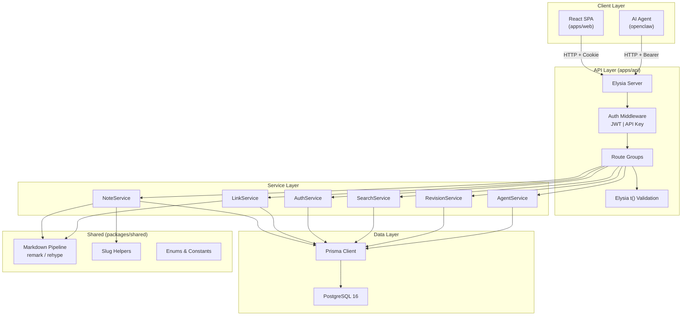
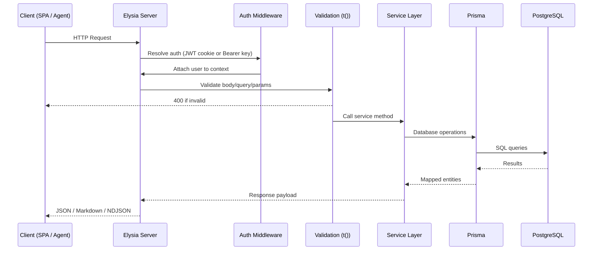
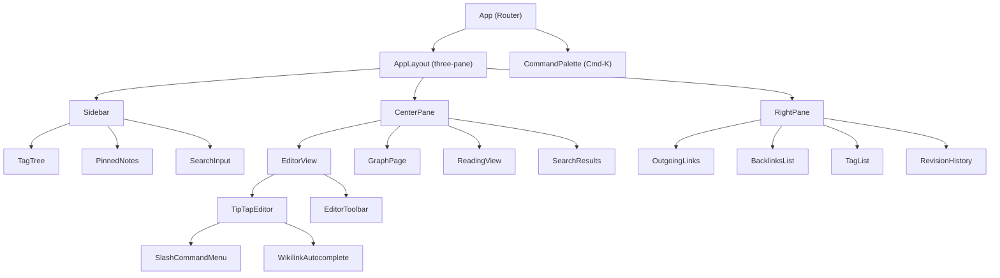
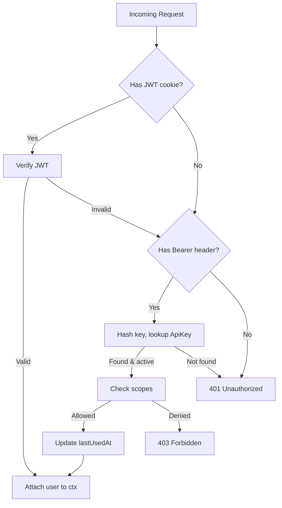

# Design Document — Mycelium (Dual-Audience Knowledge Base)

## Overview

Mycelium is a Markdown-first knowledge base serving two audiences through a single backend: human users via a React SPA with a block editor, and AI agents via a stable REST/JSON API. The system stores all content as Markdown with YAML frontmatter, treats inter-note relationships (wikilinks/backlinks) as first-class database entities, and provides full-text search powered by PostgreSQL tsvector indexes.

The architecture is a Bun monorepo with three workspaces:
- **apps/api** — Elysia REST server with Prisma ORM, JWT + API key auth, and structured logging
- **apps/web** — React 18 + Vite SPA with TipTap block editor, Zustand state, TanStack Query, and react-force-graph-2d
- **packages/shared** — Markdown pipeline (remark/rehype), slug helpers, enums, and constants

All code is plain JavaScript (ESM) with JSDoc annotations. No TypeScript.

### Key Design Decisions

| Decision | Rationale |
|---|---|
| TipTap over BlockNote | TipTap's open-source `@tiptap/markdown` extension provides bidirectional Markdown parsing/serialization without Pro license. Custom wikilink node is straightforward via ProseMirror plugin. |
| PostgreSQL tsvector over external search | Avoids Elasticsearch dependency. PG 16 tsvector with GIN index handles the expected note volume. Weighted ranking (title A, content B) gives good relevance. |
| Prisma with raw SQL for FTS | Prisma manages schema/migrations but its FTS support is limited. Raw `$queryRaw` for search queries using `to_tsquery` and `ts_rank`. tsvector column maintained via DB trigger. |
| Cursor-based pagination | Consistent ordering for both human browsing and agent bulk-fetch. Uses `id` as cursor for stable pagination under concurrent writes. |
| Soft delete (ARCHIVED) | Notes are never hard-deleted. ARCHIVED status preserves link integrity and revision history. |
| JWT httpOnly cookie + Bearer API key | Dual auth paths: cookie-based for SPA (CSRF-safe httpOnly), header-based for agents. Unified middleware resolves either. |
| NDJSON streaming for agent bundle | Allows agents to process notes incrementally without buffering the entire knowledge base in memory. |

## Architecture

### System Architecture



### Request Flow



### Note Save Pipeline

When a note is created or updated, the following pipeline executes in a single Prisma transaction:

```mermaid
flowchart LR
    A[Receive content] --> B[Parse YAML frontmatter]
    B --> C[Generate slug from title]
    C --> D[Extract wikilinks]
    D --> E[Generate excerpt]
    E --> F[Upsert Note row]
    F --> G[Reconcile Link table]
    G --> H[Resolve unresolved links]
    H --> I[Create Revision row]
    I --> J[Update tsvector trigger fires]
```



## Components and Interfaces

### API Route Groups

All routes are prefixed with `/api/v1`. Elysia route groups organize endpoints by domain.

| Group | Prefix | Auth | Description |
|---|---|---|---|
| auth | `/api/v1/auth` | Public (register/login), Protected (logout/me) | Registration, login, logout, current user |
| notes | `/api/v1/notes` | Protected | CRUD, search, format negotiation |
| tags | `/api/v1/tags` | Protected | List tags with counts, notes by tag |
| graph | `/api/v1/graph` | Protected | Full graph and ego-subgraph |
| agent | `/api/v1/agent` | API Key only | Manifest, bundle stream, simplified notes |
| apiKeys | `/api/v1/api-keys` | Protected (JWT only) | Create, list, revoke API keys |
| health | `/health`, `/ready` | Public | Liveness and readiness probes |

### Service Layer Interfaces

```javascript
// NoteService
/** @param {{ title: string, content: string, status?: string, tags?: string[] }} data */
createNote(userId, data) → Note
/** @param {{ cursor?: string, limit?: number, status?: string, tag?: string, q?: string }} opts */
listNotes(userId, opts) → { notes: Note[], nextCursor: string | null }
getNote(userId, slug) → Note | null
getNoteMarkdown(userId, slug) → string
updateNote(userId, slug, data) → Note
archiveNote(userId, slug) → void

// LinkService
reconcileLinks(noteId, wikilinks) → void
resolveUnresolvedLinks(noteId, title) → void
getBacklinks(noteId) → Note[]
getGraph(userId, opts) → { nodes: GraphNode[], edges: GraphEdge[] }

// AuthService
register(email, password, displayName) → User
login(email, password) → { user: User, token: string }
verifyJwt(token) → User | null
verifyApiKey(key) → { user: User, scopes: string[] } | null

// SearchService
search(userId, query, filters) → { notes: Note[], nextCursor: string | null }

// RevisionService
listRevisions(noteId, opts) → { revisions: Revision[], nextCursor: string | null }
getRevision(revisionId) → Revision | null

// AgentService
getManifest() → ManifestObject
streamBundle(userId) → ReadableStream<NDJSON>
listAgentNotes(userId, opts) → SimplifiedNote[]
```

### Markdown Pipeline (packages/shared)

The shared Markdown pipeline exposes pure functions consumed by both the API server and the SPA.

```javascript
// packages/shared/markdown.js

/** Parse YAML frontmatter from Markdown string */
parseFrontmatter(markdown) → { frontmatter: object, body: string }

/** Serialize frontmatter object + body back to Markdown with YAML header */
serializeFrontmatter(frontmatter, body) → string

/** Extract all [[Wikilink]] titles from Markdown content */
extractWikilinks(markdown) → string[]

/** Generate a plain-text excerpt from Markdown body (first N chars) */
generateExcerpt(markdown, maxLength = 200) → string

/** Parse Markdown to mdast AST */
parseMarkdown(markdown) → mdastTree

/** Serialize mdast AST back to Markdown string */
serializeMarkdown(mdastTree) → string

/** Render Markdown to HTML (for SPA reading view) */
renderToHtml(markdown) → string
```

### Slug Helpers (packages/shared)

```javascript
// packages/shared/slug.js

/** Generate URL-safe slug from title */
slugify(title) → string

/** Ensure slug uniqueness by appending numeric suffix */
uniqueSlug(title, existingSlugs) → string
```

### Zustand Stores (apps/web)

| Store | Key State | Responsibilities |
|---|---|---|
| `useAuthStore` | `user`, `isAuthenticated`, `login()`, `logout()`, `checkAuth()` | JWT session state, persisted via cookie presence |
| `useNotesStore` | `selectedSlug`, `pinnedSlugs`, `selectNote()`, `togglePin()` | Note selection and pinning |
| `useEditorStore` | `isDirty`, `content`, `setContent()`, `resetDirty()` | Editor dirty tracking, unsaved changes guard |
| `useUIStore` | `theme`, `sidebarOpen`, `rightPaneOpen`, `readingMode`, `setTheme()`, `toggleSidebar()` | UI preferences, persisted via Zustand persist middleware |

### TanStack Query Keys

```javascript
// Query key factory
const noteKeys = {
  all:    ['notes'],
  lists:  (filters) => ['notes', 'list', filters],
  detail: (slug)    => ['notes', 'detail', slug],
  md:     (slug)    => ['notes', 'md', slug],
}
const tagKeys    = { all: ['tags'] }
const graphKeys  = { all: ['graph'], ego: (slug, depth) => ['graph', slug, depth] }
const revKeys    = { list: (noteId) => ['revisions', noteId] }
const searchKeys = { query: (q) => ['search', q] }
```

### SPA Component Tree



### Auth Middleware Flow



## Data Models

### Prisma Schema

```prisma
enum NoteStatus {
  DRAFT
  PUBLISHED
  ARCHIVED
}

model User {
  id          String   @id @default(cuid())
  email       String   @unique
  password    String   // bcrypt hash
  displayName String
  createdAt   DateTime @default(now())
  updatedAt   DateTime @updatedAt

  notes       Note[]
  apiKeys     ApiKey[]

  @@index([email])
}

model Note {
  id          String     @id @default(cuid())
  slug        String     @unique
  title       String
  content     String     // full Markdown with frontmatter
  frontmatter Json?      // parsed YAML as JSON
  excerpt     String?
  status      NoteStatus @default(DRAFT)
  pinned      Boolean    @default(false)
  createdAt   DateTime   @default(now())
  updatedAt   DateTime   @updatedAt

  userId      String
  user        User       @relation(fields: [userId], references: [id])

  outLinks    Link[]     @relation("FromNote")
  inLinks     Link[]     @relation("ToNote")
  tags        Tag[]
  revisions   Revision[]

  @@index([slug])
  @@index([status])
  @@index([userId])
}

model Link {
  id        String   @id @default(cuid())
  fromId    String
  toId      String?  // null when target note doesn't exist yet
  toTitle   String?  // stored for unresolved links
  relation  String?  // optional typed relation
  createdAt DateTime @default(now())

  from      Note     @relation("FromNote", fields: [fromId], references: [id], onDelete: Cascade)
  to        Note?    @relation("ToNote", fields: [toId], references: [id], onDelete: SetNull)

  @@index([fromId])
  @@index([toId])
}

model Tag {
  id    String @id @default(cuid())
  name  String @unique
  notes Note[]

  @@index([name])
}

model Revision {
  id        String   @id @default(cuid())
  content   String   // full Markdown snapshot
  message   String?  // optional commit message
  createdAt DateTime @default(now())

  noteId    String
  note      Note     @relation(fields: [noteId], references: [id], onDelete: Cascade)

  @@index([noteId])
}

model ApiKey {
  id         String    @id @default(cuid())
  name       String
  keyHash    String    @unique // SHA-256 hash of the plaintext key
  scopes     String[]  // e.g. ["notes:read", "notes:write", "agent:read"]
  lastUsedAt DateTime?
  createdAt  DateTime  @default(now())

  userId     String
  user       User      @relation(fields: [userId], references: [id], onDelete: Cascade)

  @@index([keyHash])
}
```

### Full-Text Search Setup

Since Prisma doesn't natively support tsvector columns, the tsvector is managed via a custom migration:

```sql
-- Custom migration: add tsvector column and GIN index
ALTER TABLE "Note" ADD COLUMN "searchVector" tsvector
  GENERATED ALWAYS AS (
    setweight(to_tsvector('english', coalesce(title, '')), 'A') ||
    setweight(to_tsvector('english', coalesce(content, '')), 'B')
  ) STORED;

CREATE INDEX "Note_searchVector_idx" ON "Note" USING GIN ("searchVector");
```

Search queries use raw SQL through Prisma:

```javascript
const results = await prisma.$queryRaw`
  SELECT id, slug, title, excerpt, status,
         ts_rank("searchVector", plainto_tsquery('english', ${query})) AS rank
  FROM "Note"
  WHERE "userId" = ${userId}
    AND "searchVector" @@ plainto_tsquery('english', ${query})
    AND "status" != 'ARCHIVED'
  ORDER BY rank DESC
  LIMIT ${limit + 1}
`;
```

### API Key Hashing

API keys are generated as random 32-byte hex strings. Only the SHA-256 hash is stored. On authentication, the incoming key is hashed and looked up:

```javascript
import { createHash, randomBytes } from 'crypto';

function generateApiKey() {
  const plaintext = `myc_${randomBytes(32).toString('hex')}`;
  const hash = createHash('sha256').update(plaintext).digest('hex');
  return { plaintext, hash };
}

function hashApiKey(key) {
  return createHash('sha256').update(key).digest('hex');
}
```

### Cursor-Based Pagination

All list endpoints use cursor-based pagination with a consistent pattern:

```javascript
/**
 * @param {{ cursor?: string, limit?: number }} opts
 * @returns {{ items: T[], nextCursor: string | null }}
 */
async function paginate(model, where, opts) {
  const limit = opts.limit ?? 20;
  const items = await prisma[model].findMany({
    where,
    take: limit + 1,
    ...(opts.cursor ? { cursor: { id: opts.cursor }, skip: 1 } : {}),
    orderBy: { createdAt: 'desc' },
  });
  const hasMore = items.length > limit;
  if (hasMore) items.pop();
  return {
    items,
    nextCursor: hasMore ? items[items.length - 1].id : null,
  };
}
```
